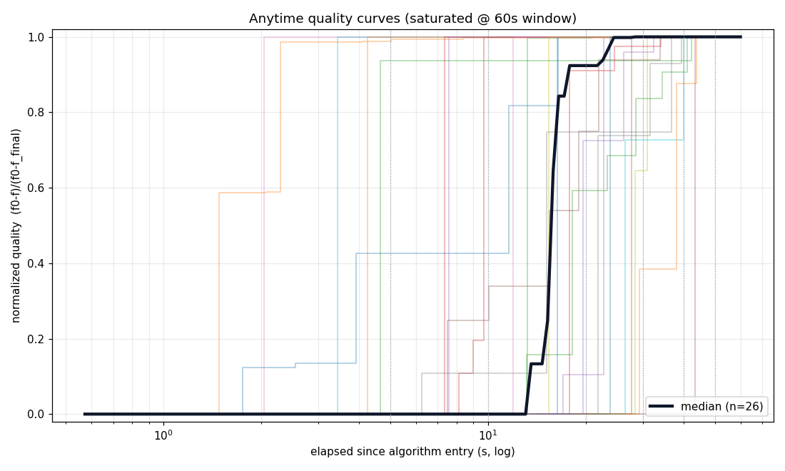
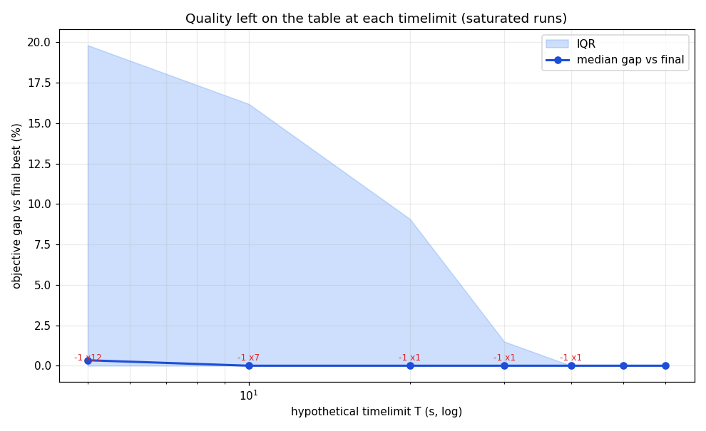
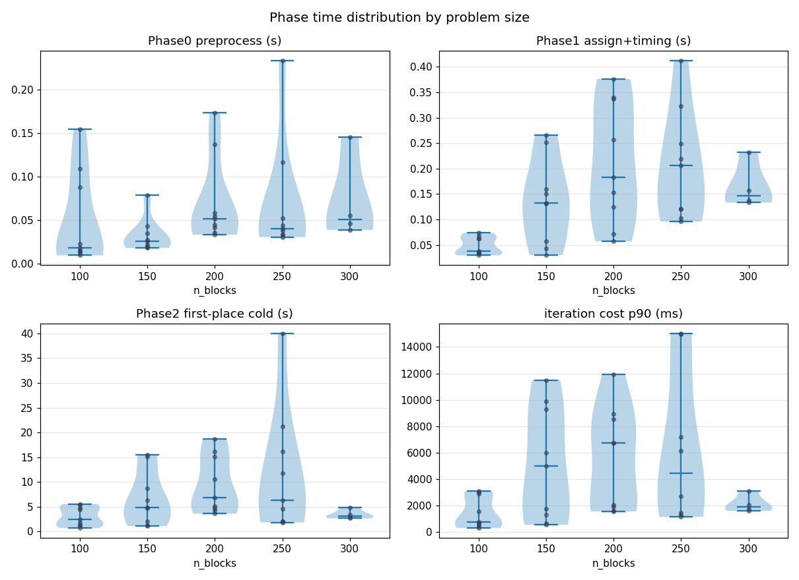
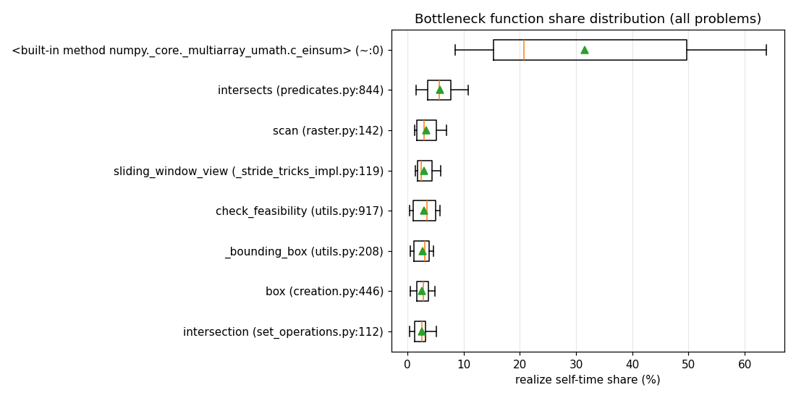
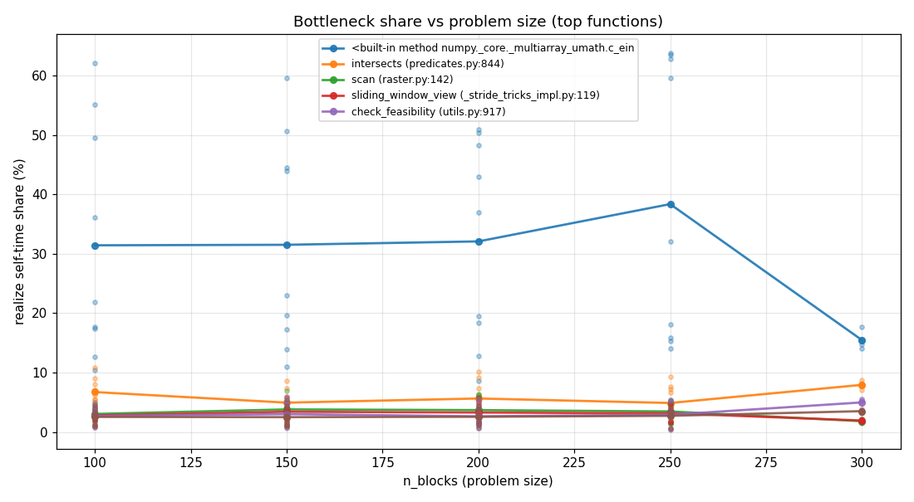
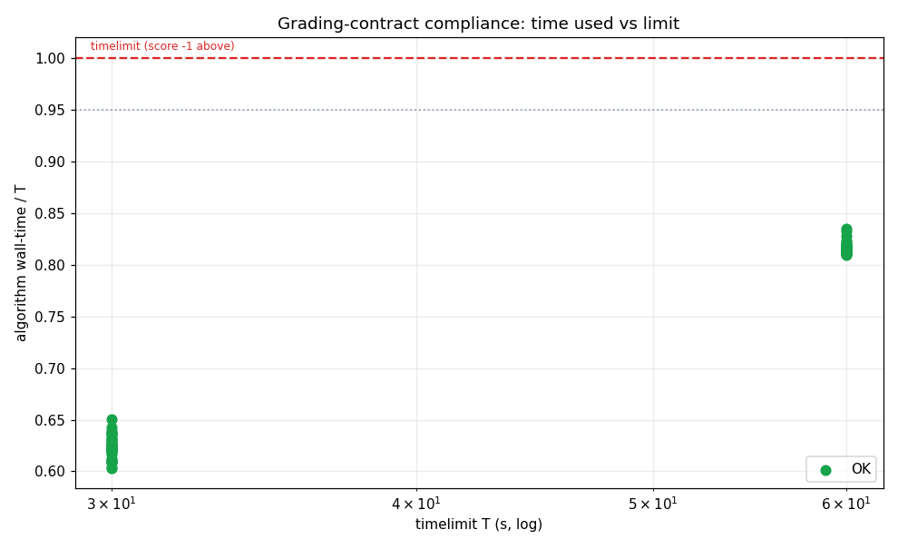

# OGC 2026 성능/시간제한 분석 보고서

- 시작 2026-07-13 09:15:36 · 갱신 2026-07-13 10:59:36 · 진행 **120/120** (anytime 40 · real 80 · 오류 0)
- 설정: mode=both · anytime horizon=60s(member0 단일 ALNS, 시계=load+preprocess+alns, 진단 제외) · real timelimits=[30.0, 60.0] grace=0.15 · construction=격자 스캔+시간순 투입 · 체크포인트=['5', '10', '20', '30', '40', '50', '60']

> 채점 계약(§3.2~3.3): timelimit 문제별 상이(수분~30분), **시간초과=crash=infeasible=−1점**, 자원 4코어/16GB. 본 수치는 개발 머신 기준 → 절대 초가 아니라 **여유 비율(margin_frac)** 로 판단.

## 1. 진단 요약 (anytime 성공 문제 기준)

| 지표 | 평균 | 중앙값 | 최소 | 최대 |
|---|---|---|---|---|
| Phase0 preprocess (s) | 0.057 | 0.039 | 0.010 | 0.233 |
| Phase1 assignment (s) | 0.150 | 0.129 | 0.029 | 0.410 |
| Phase1 timing (s) | 0.001 | 0.002 | 0.001 | 0.004 |
| Phase2 first place cold (격자 마스크+NFP) (s) | 7.296 | 4.722 | 0.728 | 40.007 |
| Construction startup total (s) | 7.505 | 4.930 | 0.781 | 40.652 |
| 첫 인증해 시각 t_first_solution (s) | 7.36 | 4.41 | 0.82 | 42.20 |
| ALNS iters/sec | 0.73 | 0.47 | 0.02 | 3.73 |
| 반복 1회 비용 p90 (ms) | 4303.3 | 2044.3 | 318.5 | 15029.6 |
| 반복 1회 비용 max (ms) | 4972.8 | 2879.5 | 703.7 | 15029.6 |
| ALNS improve @60s (%) | 14.56 | 7.95 | 0.00 | 96.47 |
| forced (ALNS best) | 0.0 | 0.0 | 0 | 0 |

## 2. 가상 timelimit 별 품질 (한 번의 긴 관측에서 후처리로 읽음)

셀 = 그 시각의 incumbent objective (최종 대비 +gap%). `-1` = 그 시각까지 인증해 없음(서버라면 **−1점**).

| prob | h(s) | 5s | 10s | 20s | 30s | 40s | 50s | 60s |
|---|---|---|---|---|---|---|---|---|
| train/prob_1 | 60 | 701459 (+32.8%) | 701459 (+32.8%) | 528085 (+0.0%) | 528085 (+0.0%) | 528085 (+0.0%) | 528085 (+0.0%) | 528085 (+0.0%) |
| train/prob_2 | 60 | 6990 (+30.9%) | 5840 (+9.4%) | 5840 (+9.4%) | 5610 (+5.1%) | 5340 (+0.0%) | 5340 (+0.0%) | 5340 (+0.0%) |
| train/prob_3 | 60 | 171608 (+29.2%) | 171608 (+29.2%) | 132911 (+0.1%) | 132801 (+0.0%) | 132801 (+0.0%) | 132801 (+0.0%) | 132801 (+0.0%) |
| train/prob_4 | 60 | 259285 (+0.0%) | 259285 (+0.0%) | 259285 (+0.0%) | 259285 (+0.0%) | 259285 (+0.0%) | 259285 (+0.0%) | 259285 (+0.0%) |
| train/prob_5 | 60 | 639648 (+38.6%) | 461654 (+0.0%) | 461654 (+0.0%) | 461654 (+0.0%) | 461654 (+0.0%) | 461654 (+0.0%) | 461654 (+0.0%) |
| train/prob_6 | 60 | **-1** | 628275 (+63.6%) | 602845 (+57.0%) | 383940 (+0.0%) | 383940 (+0.0%) | 383940 (+0.0%) | 383940 (+0.0%) |
| train/prob_7 | 60 | 437373 (+4.1%) | 437373 (+4.1%) | 437373 (+4.1%) | 420081 (+0.0%) | 420081 (+0.0%) | 420081 (+0.0%) | 420081 (+0.0%) |
| train/prob_8 | 60 | 11252 (+0.0%) | 11252 (+0.0%) | 11252 (+0.0%) | 11252 (+0.0%) | 11252 (+0.0%) | 11252 (+0.0%) | 11252 (+0.0%) |
| train/prob_9 | 60 | 380814 (+36.0%) | 369902 (+32.1%) | 305382 (+9.1%) | 305382 (+9.1%) | 279981 (+0.0%) | 279981 (+0.0%) | 279981 (+0.0%) |
| train/prob_10 | 60 | 170809 (+0.0%) | 170809 (+0.0%) | 170809 (+0.0%) | 170809 (+0.0%) | 170809 (+0.0%) | 170809 (+0.0%) | 170809 (+0.0%) |
| train/prob_11 | 60 | 434413 (+0.0%) | 434413 (+0.0%) | 434413 (+0.0%) | 434413 (+0.0%) | 434413 (+0.0%) | 434413 (+0.0%) | 434413 (+0.0%) |
| train/prob_12 | 60 | 880402 (+19.8%) | 880402 (+19.8%) | 880402 (+19.8%) | 786332 (+7.0%) | 734818 (+0.0%) | 734818 (+0.0%) | 734818 (+0.0%) |
| train/prob_13 | 60 | 542026 (+0.0%) | 542026 (+0.0%) | 542026 (+0.0%) | 542026 (+0.0%) | 542026 (+0.0%) | 542026 (+0.0%) | 542026 (+0.0%) |
| train/prob_14 | 60 | **-1** | 730895 (+19.7%) | 610663 (+0.0%) | 610663 (+0.0%) | 610663 (+0.0%) | 610663 (+0.0%) | 610663 (+0.0%) |
| train/prob_15 | 60 | 175795 (+0.0%) | 175795 (+0.0%) | 175795 (+0.0%) | 175795 (+0.0%) | 175795 (+0.0%) | 175795 (+0.0%) | 175795 (+0.0%) |
| train/prob_16 | 60 | 148554 (+0.0%) | 148554 (+0.0%) | 148554 (+0.0%) | 148554 (+0.0%) | 148554 (+0.0%) | 148554 (+0.0%) | 148554 (+0.0%) |
| train/prob_17 | 60 | 154929 (+1.7%) | 154929 (+1.7%) | 154929 (+1.7%) | 154929 (+1.7%) | 154929 (+1.7%) | 152385 (+0.0%) | 152385 (+0.0%) |
| train/prob_18 | 60 | 770783 (+0.0%) | 770783 (+0.0%) | 770783 (+0.0%) | 770783 (+0.0%) | 770783 (+0.0%) | 770783 (+0.0%) | 770783 (+0.0%) |
| train/prob_19 | 60 | 292907 (+0.0%) | 292907 (+0.0%) | 292907 (+0.0%) | 292907 (+0.0%) | 292907 (+0.0%) | 292907 (+0.0%) | 292907 (+0.0%) |
| train/prob_20 | 60 | 4920449 (+0.7%) | 4887552 (+0.0%) | 4887552 (+0.0%) | 4887552 (+0.0%) | 4887552 (+0.0%) | 4887552 (+0.0%) | 4887552 (+0.0%) |
| train/prob_21 | 60 | 5859254 (+1.9%) | 5748242 (+0.0%) | 5748242 (+0.0%) | 5748242 (+0.0%) | 5748242 (+0.0%) | 5748242 (+0.0%) | 5748242 (+0.0%) |
| train/prob_22 | 60 | 2019602 (+0.0%) | 2019602 (+0.0%) | 2019602 (+0.0%) | 2019602 (+0.0%) | 2019602 (+0.0%) | 2019602 (+0.0%) | 2019602 (+0.0%) |
| train/prob_23 | 60 | 9343806 (+24.3%) | 8890300 (+18.2%) | 7975170 (+6.1%) | 7631565 (+1.5%) | 7519462 (+0.0%) | 7519462 (+0.0%) | 7519462 (+0.0%) |
| train/prob_24 | 60 | 4462312 (+0.0%) | 4462312 (+0.0%) | 4462312 (+0.0%) | 4462312 (+0.0%) | 4462312 (+0.0%) | 4462312 (+0.0%) | 4462312 (+0.0%) |
| train/prob_25 | 60 | 593534 (+6.2%) | 593534 (+6.2%) | 558638 (+0.0%) | 558638 (+0.0%) | 558638 (+0.0%) | 558638 (+0.0%) | 558638 (+0.0%) |
| train/prob_26 | 60 | **-1** | **-1** | 45245129 (+37.5%) | 36144300 (+9.8%) | 32904371 (+0.0%) | 32904371 (+0.0%) | 32904371 (+0.0%) |
| train/prob_27 | 60 | **-1** | 54996807 (+16.2%) | 47337005 (+0.0%) | 47337005 (+0.0%) | 47337005 (+0.0%) | 47337005 (+0.0%) | 47337005 (+0.0%) |
| train/prob_28 | 60 | 13836161 (+6.0%) | 13836161 (+6.0%) | 13836161 (+6.0%) | 13266580 (+1.6%) | 13266580 (+1.6%) | 13051601 (+0.0%) | 13051601 (+0.0%) |
| train/prob_29 | 60 | 3832090 (+0.0%) | 3832090 (+0.0%) | 3832090 (+0.0%) | 3832090 (+0.0%) | 3832090 (+0.0%) | 3832090 (+0.0%) | 3832090 (+0.0%) |
| train/prob_30 | 60 | **-1** | **-1** | 14168999 (+32.8%) | 10673377 (+0.0%) | 10673377 (+0.0%) | 10673377 (+0.0%) | 10673377 (+0.0%) |
| train/prob_31 | 60 | **-1** | 33416340 (+0.0%) | 33416340 (+0.0%) | 33416340 (+0.0%) | 33416340 (+0.0%) | 33416340 (+0.0%) | 33416340 (+0.0%) |
| train/prob_32 | 60 | **-1** | **-1** | 8019207 (+38.4%) | 7166165 (+23.6%) | 6069591 (+4.7%) | 5795849 (+0.0%) | 5795849 (+0.0%) |
| train/prob_33 | 60 | **-1** | **-1** | **-1** | **-1** | 28064665 (+28.8%) | 21797093 (+0.0%) | 21797093 (+0.0%) |
| train/prob_34 | 60 | **-1** | 5702750 (+55.3%) | 4499861 (+22.6%) | 4001812 (+9.0%) | 3859335 (+5.1%) | 3671118 (+0.0%) | 3671118 (+0.0%) |
| train/prob_35 | 60 | **-1** | **-1** | 7300869 (+2.7%) | 7159927 (+0.8%) | 7105926 (+0.0%) | 7105926 (+0.0%) | 7105926 (+0.0%) |
| train/prob_36 | 60 | 837212 (+0.0%) | 837212 (+0.0%) | 837212 (+0.0%) | 837212 (+0.0%) | 837212 (+0.0%) | 837212 (+0.0%) | 837212 (+0.0%) |
| train/prob_37 | 60 | **-1** | **-1** | 8604481 (+10.0%) | 7937240 (+1.5%) | 7822411 (+0.0%) | 7822411 (+0.0%) | 7822411 (+0.0%) |
| train/prob_38 | 60 | **-1** | **-1** | **-1** | 108102591 (+50.8%) | 77820033 (+8.6%) | 77820033 (+8.6%) | 71664185 (+0.0%) |
| train/prob_39 | 60 | **-1** | **-1** | 45832615 (+10.4%) | 45832615 (+10.4%) | 45832615 (+10.4%) | 41522429 (+0.0%) | 41522429 (+0.0%) |
| train/prob_40 | 60 | **-1** | **-1** | **-1** | **-1** | **-1** | 8078256 (+0.0%) | 8078256 (+0.0%) |
| **중앙값 gap (포화 38개 · h=60s 절단 기준)** | | 0.3% | 0.0% | 0.0% | 0.0% | 0.0% | 0.0% | 0.0% |
| **−1 위험 문제수** | | 12 | 7 | 1 | 1 | 1 | 0 | 0 |

> **2개**는 gap 집계·곡선에서 제외(h=60s 절단 시 미포화이거나 관측이 그보다 짧음).

### 2.1 수렴/포화 ("몇 초면 충분한가")

| prob | 첫 해(s) | 최종1%이내 도달(s) | 마지막 개선(s) | 개선횟수 | 포화@h |
|---|---|---|---|---|---|
| train/prob_1 | 1.2 | 16.5 | 16.5 | 5 | Y |
| train/prob_2 | 0.8 | 38.8 | 38.8 | 8 | Y |
| train/prob_3 | 1.3 | 13.2 | 21.0 | 2 | Y |
| train/prob_4 | 2.7 | 2.7 | 2.7 | 0 | Y |
| train/prob_5 | 1.7 | 9.7 | 9.7 | 3 | Y |
| train/prob_6 | 6.1 | 22.8 | 22.8 | 2 | Y |
| train/prob_7 | 1.4 | 27.7 | 27.7 | 1 | Y |
| train/prob_8 | 1.4 | 2.0 | 2.0 | 1 | Y |
| train/prob_9 | 4.3 | 36.7 | 36.7 | 3 | Y |
| train/prob_10 | 3.7 | 3.7 | 3.7 | 0 | Y |
| train/prob_11 | 4.7 | 4.7 | 4.7 | 0 | Y |
| train/prob_12 | 4.3 | 31.0 | 31.0 | 2 | Y |
| train/prob_13 | 2.1 | 3.4 | 3.4 | 1 | Y |
| train/prob_14 | 6.4 | 16.4 | 16.4 | 1 | Y |
| train/prob_15 | 2.2 | 2.2 | 2.2 | 0 | Y |
| train/prob_16 | 2.2 | 4.2 | 4.2 | 1 | Y |
| train/prob_17 | 3.2 | 42.3 | 42.3 | 2 | Y |
| train/prob_18 | 2.8 | 2.8 | 2.8 | 0 | Y |
| train/prob_19 | 2.5 | 2.5 | 2.5 | 0 | Y |
| train/prob_20 | 4.3 | 4.3 | 7.3 | 1 | Y |
| train/prob_21 | 4.5 | 7.6 | 7.6 | 1 | Y |
| train/prob_22 | 1.7 | 1.7 | 1.7 | 0 | Y |
| train/prob_23 | 4.3 | 33.9 | 33.9 | 6 | Y |
| train/prob_24 | 4.0 | 4.0 | 4.0 | 0 | Y |
| train/prob_25 | 5.0 | 11.9 | 11.9 | 1 | Y |
| train/prob_26 | 11.5 | 39.6 | 39.6 | 3 | Y |
| train/prob_27 | 8.5 | 15.4 | 15.4 | 1 | Y |
| train/prob_28 | 4.8 | 40.1 | 40.1 | 2 | Y |
| train/prob_29 | 5.0 | 5.0 | 5.0 | 0 | Y |
| train/prob_30 | 14.1 | 23.8 | 23.8 | 1 | Y |
| train/prob_31 | 5.3 | 5.3 | 5.3 | 0 | Y |
| train/prob_32 | 18.3 | 44.0 | 44.0 | 3 | Y |
| train/prob_33 | 33.2 | NA | 49.8 | 1 | N(h=60s 부족) |
| train/prob_34 | 8.4 | 41.1 | 41.1 | 6 | Y |
| train/prob_35 | 10.7 | 24.5 | 34.1 | 3 | Y |
| train/prob_36 | 4.8 | 4.8 | 4.8 | 0 | Y |
| train/prob_37 | 11.1 | 32.4 | 32.4 | 3 | Y |
| train/prob_38 | 20.4 | NA | 52.0 | 2 | N(h=60s 부족) |
| train/prob_39 | 17.4 | 43.4 | 43.4 | 1 | Y |
| train/prob_40 | 42.2 | 42.2 | 42.2 | 0 | Y |

> **2개 문제가 관측 지평 끝까지 개선 중** — 더 긴 --horizon 재관측 권장.

## 3. 구성(startup) 시간의 phase별 비중

- Phase0 preprocess : **  0.8%** (2.3s)
- Phase1 배정+타이밍 : **  2.0%** (6.1s)
- Phase2 첫배치      : ** 97.2%** (291.8s)  ← 격자 마스크 빌드 + 첫 배치(문제당 1회)

> 반복 1회 비용은 cold가 아니라 **iter ms**(warm). 해 품질 ∝ **iters/sec**이므로 낮은 문제가 실질 병목.

## 4. 병목 함수 (realize self-time 비중, 전 문제 평균)

| 함수 | 평균 비중 (%) |
|---|---|
| `<built-in method numpy._core._multiarray_umath.c_einsum> (~:0)` | 31.6 |
| `intersects (predicates.py:844)` | 5.8 |
| `scan (raster.py:142)` | 3.3 |
| `sliding_window_view (_stride_tricks_impl.py:119)` | 3.0 |
| `check_feasibility (utils.py:917)` | 2.9 |
| `box (creation.py:446)` | 2.6 |
| `_bounding_box (utils.py:208)` | 2.5 |
| `intersection (set_operations.py:112)` | 2.3 |
| `as_strided (_stride_tricks_impl.py:37)` | 2.2 |
| `order_cells (raster.py:189)` | 2.1 |
| `wrapped (decorators.py:73)` | 2.0 |
| `bounding_rect (utils.py:365)` | 1.9 |

> realize hot loop CPU의 비중(%). 상위 함수 최적화 -> iters/sec 상승.

## 5. 채점 계약 컴플라이언스 (실제 algorithm(prob,T), 새 프로세스+하드킬)

| prob | T=30s | T=60s |
|---|---|---|
| train/prob_1 | OK 615358 (여유 37%) | OK 438430 (여유 18%) |
| train/prob_2 | OK 6190 (여유 36%) | OK 5840 (여유 18%) |
| train/prob_3 | OK 144941 (여유 37%) | OK 106134 (여유 18%) |
| train/prob_4 | OK 259285 (여유 36%) | OK 249519 (여유 17%) |
| train/prob_5 | OK 501261 (여유 36%) | OK 461654 (여유 18%) |
| train/prob_6 | OK 628275 (여유 36%) | OK 383940 (여유 18%) |
| train/prob_7 | OK 384039 (여유 36%) | OK 294124 (여유 18%) |
| train/prob_8 | OK 11252 (여유 37%) | OK 11252 (여유 18%) |
| train/prob_9 | OK 327482 (여유 35%) | OK 308222 (여유 18%) |
| train/prob_10 | OK 170809 (여유 37%) | OK 170809 (여유 18%) |
| train/prob_11 | OK 434413 (여유 37%) | OK 291554 (여유 18%) |
| train/prob_12 | OK 573550 (여유 38%) | OK 573550 (여유 18%) |
| train/prob_13 | OK 542026 (여유 37%) | OK 542026 (여유 18%) |
| train/prob_14 | OK 606449 (여유 37%) | OK 606449 (여유 18%) |
| train/prob_15 | OK 124983 (여유 37%) | OK 108654 (여유 18%) |
| train/prob_16 | OK 148554 (여유 36%) | OK 148554 (여유 18%) |
| train/prob_17 | OK 154929 (여유 36%) | OK 131724 (여유 18%) |
| train/prob_18 | OK 677452 (여유 34%) | OK 677452 (여유 18%) |
| train/prob_19 | OK 282240 (여유 36%) | OK 282240 (여유 18%) |
| train/prob_20 | OK 3819760 (여유 36%) | OK 3819760 (여유 16%) |
| train/prob_21 | OK 4116900 (여유 37%) | OK 4116900 (여유 18%) |
| train/prob_22 | OK 1859606 (여유 38%) | OK 1859606 (여유 18%) |
| train/prob_23 | OK 8385652 (여유 37%) | OK 7631565 (여유 18%) |
| train/prob_24 | OK 4232604 (여유 37%) | OK 4232604 (여유 18%) |
| train/prob_25 | OK 593534 (여유 37%) | OK 519514 (여유 19%) |
| train/prob_26 | OK 45245129 (여유 39%) | OK 31401703 (여유 18%) |
| train/prob_27 | OK 47337005 (여유 39%) | OK 46601699 (여유 16%) |
| train/prob_28 | OK 12741932 (여유 37%) | OK 12741932 (여유 18%) |
| train/prob_29 | OK 3760516 (여유 37%) | OK 3760516 (여유 18%) |
| train/prob_30 | OK 14168999 (여유 37%) | OK 10284999 (여유 18%) |
| train/prob_31 | OK 33416340 (여유 38%) | OK 32043041 (여유 18%) |
| train/prob_32 | OK 8019207 (여유 38%) | OK 5795849 (여유 18%) |
| train/prob_33 | OK 28064665 (여유 39%) | OK 16335235 (여유 19%) |
| train/prob_34 | OK 3478157 (여유 37%) | OK 3018161 (여유 18%) |
| train/prob_35 | OK 6872537 (여유 38%) | OK 6872537 (여유 18%) |
| train/prob_36 | OK 837212 (여유 39%) | OK 745833 (여유 18%) |
| train/prob_37 | OK 10671834 (여유 39%) | OK 7448689 (여유 17%) |
| train/prob_38 | OK 1839979293 (여유 38%) | OK 499332810 (여유 18%) |
| train/prob_39 | OK 276600179 (여유 38%) | OK 45832615 (여유 17%) |
| train/prob_40 | OK 79455260 (여유 38%) | OK 8078256 (여유 17%) |

- OK 80/80 · OK 런 여유비율 margin_frac 중앙값 0.270 (안전 기준: ≥0.05 그리고 margin_s ≥3s)

## 6. 시간제한 정책 산정 근거 (실측)

- 첫 인증해 최악 시각: **42.2s** (이보다 짧은 timelimit이면 그 문제는 −1 확정)
- 반복 1회 최악 비용: **15.0s** (realize는 variant 도중 중단 불가 → 딜라인 초과분의 하한)

> 딜라인은 고정 상수가 아니라 `timelimit - reserve`로 인자에서 유도할 것. reserve 크기는 위 실측치(첫 해 시각·반복 최악 비용)와 real 모드의 여유 비율로 산정.

## 7. 상관

- 처리량 최저 top-3 (n_blocks, iters/s): (250, 0.02), (250, 0.03), (200, 0.03)
- forced(강제배치) ↔ Z1(지연) 상관계수: **+0.00** (+1에 가까울수록 강제배치 줄이기가 Z1 최우선 레버)

## 8. 문제별 상세 (anytime)

| prob | n_blk | P0(s) | P1(s) | P2cold(s) | ALNS(s) | iters | iters/s | improve% | 포화 | forced | Z1 | objective | feas |
|---|---|---|---|---|---|---|---|---|---|---|---|---|---|
| train/prob_1 | 100 | 0.010 | 0.030 | 1.222 | 57.99 | 170 | 2.93 | 36.37 | Y | 0 | 18 | 528085 | Y |
| train/prob_2 | 100 | 0.018 | 0.035 | 0.728 | 57.98 | 216 | 3.73 | 96.47 | Y | 0 | 0 | 5340 | Y |
| train/prob_3 | 100 | 0.088 | 0.038 | 1.269 | 57.97 | 125 | 2.16 | 22.61 | Y | 0 | 3 | 132801 | Y |
| train/prob_4 | 100 | 0.023 | 0.035 | 2.395 | 57.96 | 90 | 1.55 | 0.00 | Y | 0 | 8 | 259285 | Y |
| train/prob_5 | 150 | 0.020 | 0.057 | 2.107 | 58.13 | 67 | 1.15 | 27.83 | Y | 0 | 25 | 461654 | Y |
| train/prob_6 | 150 | 0.078 | 0.251 | 4.813 | 57.80 | 56 | 0.97 | 38.89 | Y | 0 | 10 | 383940 | Y |
| train/prob_7 | 150 | 0.018 | 0.043 | 1.233 | 58.00 | 101 | 1.74 | 3.95 | Y | 0 | 18 | 420081 | Y |
| train/prob_8 | 150 | 0.019 | 0.030 | 1.123 | 57.99 | 126 | 2.17 | 1.47 | Y | 0 | 0 | 11252 | Y |
| train/prob_9 | 200 | 0.036 | 0.057 | 5.104 | 58.07 | 42 | 0.72 | 26.48 | Y | 0 | 17 | 279981 | Y |
| train/prob_10 | 200 | 0.033 | 0.071 | 4.335 | 58.09 | 40 | 0.69 | 0.00 | Y | 0 | 5 | 170809 | Y |
| train/prob_11 | 200 | 0.137 | 0.125 | 4.756 | 57.84 | 30 | 0.52 | 0.00 | Y | 0 | 14 | 434413 | Y |
| train/prob_12 | 200 | 0.173 | 0.154 | 3.634 | 57.93 | 39 | 0.67 | 16.54 | Y | 0 | 28 | 734818 | Y |
| train/prob_13 | 250 | 0.117 | 0.121 | 2.108 | 58.02 | 44 | 0.76 | 16.42 | Y | 0 | 21 | 542026 | Y |
| train/prob_14 | 250 | 0.044 | 0.121 | 6.261 | 58.33 | 24 | 0.41 | 16.45 | Y | 0 | 28 | 610663 | Y |
| train/prob_15 | 250 | 0.034 | 0.096 | 2.074 | 58.24 | 49 | 0.84 | 0.00 | Y | 0 | 7 | 175795 | Y |
| train/prob_16 | 250 | 0.052 | 0.103 | 1.846 | 57.86 | 55 | 0.95 | 6.50 | Y | 0 | 9 | 148554 | Y |
| train/prob_17 | 300 | 0.046 | 0.137 | 2.921 | 57.73 | 38 | 0.66 | 21.16 | Y | 0 | 8 | 152385 | Y |
| train/prob_18 | 300 | 0.146 | 0.133 | 3.323 | 58.00 | 30 | 0.52 | 0.00 | Y | 0 | 52 | 770783 | Y |
| train/prob_19 | 300 | 0.056 | 0.157 | 2.663 | 58.34 | 35 | 0.60 | 0.00 | Y | 0 | 20 | 292907 | Y |
| train/prob_20 | 300 | 0.039 | 0.232 | 4.874 | 57.98 | 19 | 0.33 | 0.67 | Y | 0 | 178 | 4887552 | Y |
| train/prob_21 | 100 | 0.015 | 0.067 | 4.683 | 57.97 | 40 | 0.69 | 1.89 | Y | 0 | 404 | 5748242 | Y |
| train/prob_22 | 100 | 0.015 | 0.034 | 1.730 | 58.03 | 95 | 1.64 | 0.00 | Y | 0 | 55 | 2019602 | Y |
| train/prob_23 | 100 | 0.109 | 0.063 | 5.531 | 58.08 | 24 | 0.41 | 19.52 | Y | 0 | 554 | 7519462 | Y |
| train/prob_24 | 100 | 0.155 | 0.063 | 4.398 | 58.09 | 20 | 0.34 | 0.00 | Y | 0 | 304 | 4462312 | Y |
| train/prob_25 | 100 | 0.012 | 0.074 | 5.321 | 58.00 | 20 | 0.34 | 5.88 | Y | 0 | 799 | 558638 | Y |
| train/prob_26 | 150 | 0.035 | 0.150 | 15.453 | 58.17 | 5 | 0.09 | 27.28 | Y | 0 | 2451 | 32904371 | Y |
| train/prob_27 | 150 | 0.026 | 0.159 | 8.699 | 57.91 | 9 | 0.16 | 13.93 | Y | 0 | 3441 | 47337005 | Y |
| train/prob_28 | 150 | 0.022 | 0.133 | 4.688 | 58.86 | 7 | 0.12 | 5.67 | Y | 0 | 971 | 13051601 | Y |
| train/prob_29 | 150 | 0.043 | 0.265 | 6.361 | 58.08 | 13 | 0.22 | 0.00 | Y | 0 | 232 | 3832090 | Y |
| train/prob_30 | 150 | 0.027 | 0.131 | 15.155 | 58.34 | 5 | 0.09 | 24.67 | Y | 0 | 789 | 10673377 | Y |
| train/prob_31 | 200 | 0.051 | 0.339 | 10.515 | 58.22 | 8 | 0.14 | 0.00 | Y | 0 | 2292 | 33416340 | Y |
| train/prob_32 | 200 | 0.058 | 0.376 | 18.681 | 58.11 | 5 | 0.09 | 27.73 | Y | 0 | 1518 | 5795849 | Y |
| train/prob_33 | 200 | 0.041 | 0.183 | 16.183 | 57.98 | 2 | 0.03 | 22.33 | N | 0 | 3169 | 21797093 | Y |
| train/prob_34 | 200 | 0.044 | 0.256 | 6.881 | 58.01 | 8 | 0.14 | 35.63 | Y | 0 | 1074 | 3671118 | Y |
| train/prob_35 | 200 | 0.055 | 0.337 | 15.120 | 58.20 | 8 | 0.14 | 23.34 | Y | 0 | 522 | 7105926 | Y |
| train/prob_36 | 250 | 0.040 | 0.207 | 4.537 | 57.90 | 9 | 0.16 | 0.00 | Y | 0 | 1077 | 837212 | Y |
| train/prob_37 | 250 | 0.031 | 0.249 | 11.793 | 57.98 | 8 | 0.14 | 26.70 | Y | 0 | 2199 | 7822411 | Y |
| train/prob_38 | 250 | 0.033 | 0.323 | 21.191 | 57.93 | 3 | 0.05 | 33.71 | N | 0 | 5319 | 71664185 | Y |
| train/prob_39 | 250 | 0.038 | 0.219 | 16.127 | 58.13 | 2 | 0.03 | 9.40 | Y | 0 | 3089 | 41522429 | Y |
| train/prob_40 | 250 | 0.233 | 0.412 | 40.007 | 58.33 | 1 | 0.02 | 0.00 | Y | 0 | 11981 | 8078256 | Y |
