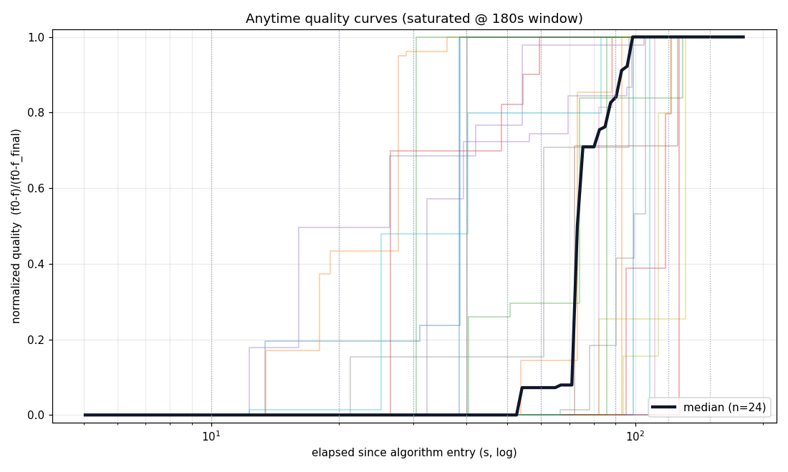
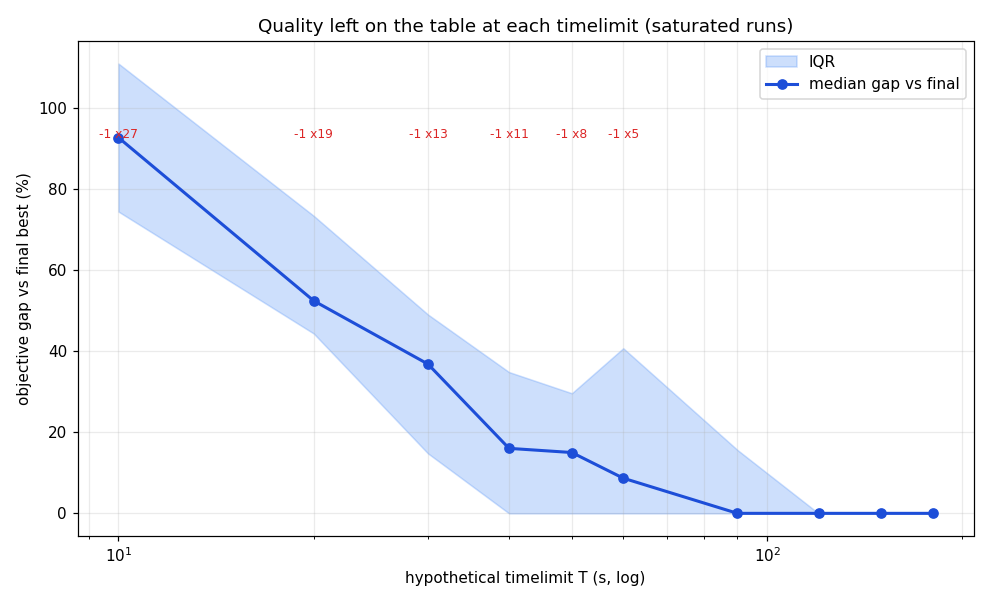
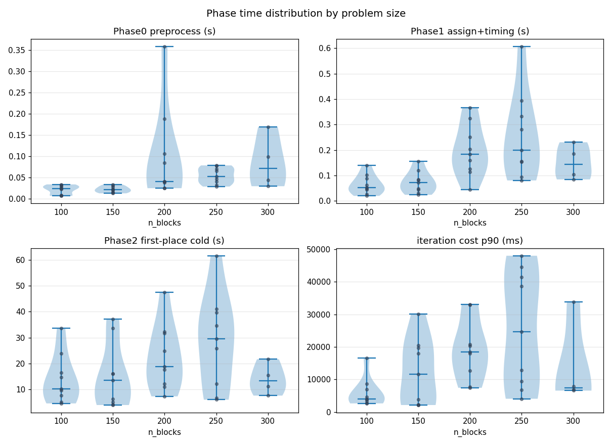
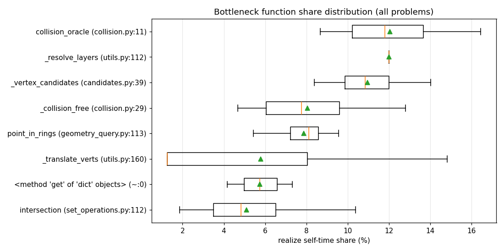
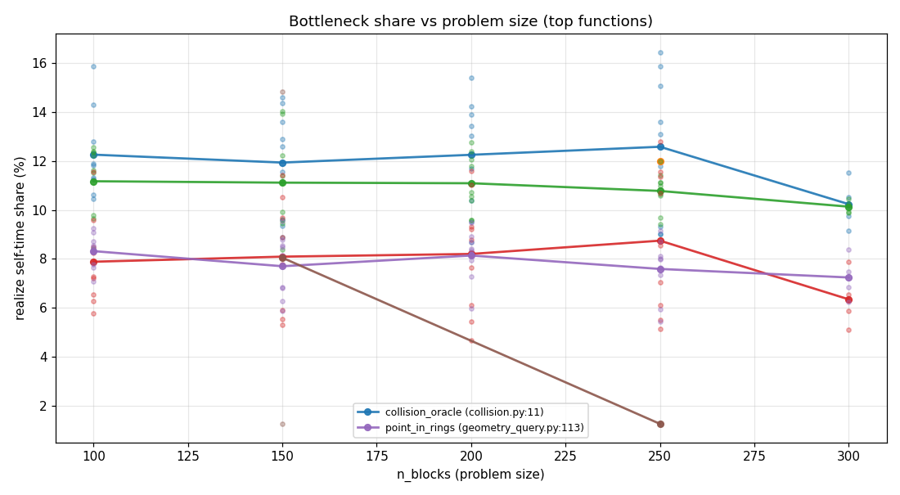
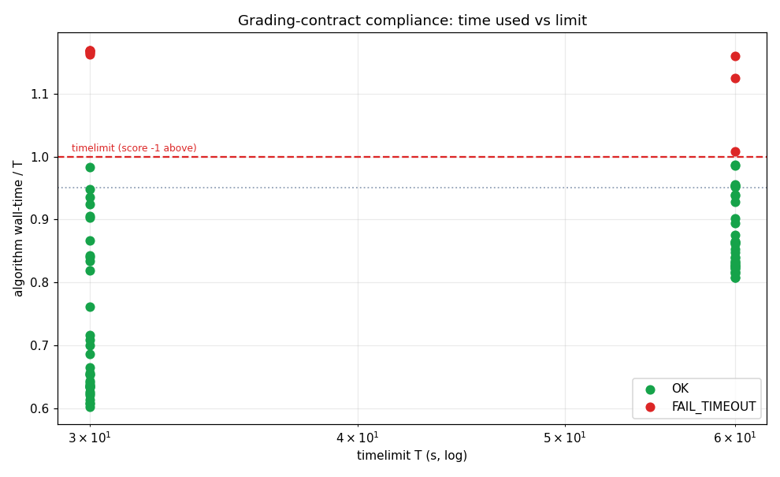

# OGC 2026 성능/시간제한 분석 보고서

- 시작 2026-07-12 15:34:02 · 갱신 2026-07-12 18:57:07 · 진행 **120/120** (anytime 40 · real 80 · 오류 0)
- 설정: mode=both · anytime horizon=180s(member0 단일 ALNS, 시계=load+preprocess+alns, 진단 제외) · real timelimits=[30.0, 60.0] grace=0.15 · 체크포인트=['10', '20', '30', '40', '50', '60', '90', '120', '150', '180']

> 채점 계약(§3.2~3.3): timelimit 문제별 상이(수분~30분), **시간초과=crash=infeasible=−1점**, 자원 4코어/16GB. 본 수치는 개발 머신 기준 → 절대 초가 아니라 **여유 비율(margin_frac)** 로 판단.

## 1. 진단 요약 (anytime 성공 문제 기준)

| 지표 | 평균 | 중앙값 | 최소 | 최대 |
|---|---|---|---|---|
| Phase0 preprocess (s) | 0.054 | 0.032 | 0.007 | 0.359 |
| Phase1 assignment (s) | 0.147 | 0.107 | 0.019 | 0.602 |
| Phase1 timing (s) | 0.001 | 0.001 | 0.000 | 0.004 |
| Phase2 first place cold NFP (s) | 19.507 | 15.793 | 4.033 | 61.543 |
| Construction startup total (s) | 19.709 | 16.005 | 4.106 | 62.004 |
| 첫 인증해 시각 t_first_solution (s) | 31.61 | 25.82 | 7.21 | 73.28 |
| ALNS iters/sec | 0.18 | 0.12 | 0.02 | 0.61 |
| 반복 1회 비용 p90 (ms) | 15540.1 | 10537.5 | 2157.7 | 47980.6 |
| 반복 1회 비용 max (ms) | 18640.8 | 15311.1 | 3409.7 | 47980.6 |
| ALNS improve @180s (%) | 28.89 | 32.52 | 0.00 | 79.40 |
| forced (ALNS best) | 18.6 | 13.0 | 0 | 78 |

## 2. 가상 timelimit 별 품질 (한 번의 긴 관측에서 후처리로 읽음)

셀 = 그 시각의 incumbent objective (최종 대비 +gap%). `-1` = 그 시각까지 인증해 없음(서버라면 **−1점**).

| prob | h(s) | 10s | 20s | 30s | 40s | 50s | 60s | 90s | 120s | 150s | 180s |
|---|---|---|---|---|---|---|---|---|---|---|---|
| train/prob_1 | 180 | **-1** | 25674987 (+64.6%) | 25674987 (+64.6%) | 15594841 (+0.0%) | 15594841 (+0.0%) | 15594841 (+0.0%) | 15594841 (+0.0%) | 15594841 (+0.0%) | 15594841 (+0.0%) | 15594841 (+0.0%) |
| train/prob_2 | 180 | **-1** | 13825035 (+218.5%) | 4982231 (+14.8%) | 4340649 (+0.0%) | 4340649 (+0.0%) | 4340219 (+0.0%) | 4340219 (+0.0%) | 4340219 (+0.0%) | 4340219 (+0.0%) | 4340219 (+0.0%) |
| train/prob_3 | 180 | **-1** | **-1** | 28358627 (+40.0%) | 28358627 (+40.0%) | 26256681 (+29.6%) | 25959424 (+28.2%) | 21559669 (+6.4%) | 21559669 (+6.4%) | 20254216 (+0.0%) | 20254216 (+0.0%) |
| train/prob_4 | 180 | **-1** | **-1** | 33202039 (+164.5%) | 33202039 (+164.5%) | 22038618 (+75.5%) | 16229551 (+29.3%) | 16229551 (+29.3%) | 16229551 (+29.3%) | 16229551 (+29.3%) | 12554262 (+0.0%) |
| train/prob_5 | 180 | 23791648 (+125.4%) | 23791648 (+125.4%) | 20486012 (+94.1%) | 16376092 (+55.2%) | 13665102 (+29.5%) | 13665102 (+29.5%) | 11703668 (+10.9%) | 10758628 (+1.9%) | 10758628 (+1.9%) | 10553574 (+0.0%) |
| train/prob_6 | 180 | **-1** | 74466235 (+44.4%) | 58493163 (+13.4%) | 58493163 (+13.4%) | 55646225 (+7.9%) | 51576103 (+0.0%) | 51576103 (+0.0%) | 51576103 (+0.0%) | 51576103 (+0.0%) | 51576103 (+0.0%) |
| train/prob_7 | 180 | 32686665 (+117.1%) | 31768324 (+111.0%) | 24138718 (+60.3%) | 20406794 (+35.6%) | 18932263 (+25.8%) | 18738303 (+24.5%) | 17418050 (+15.7%) | 17418050 (+15.7%) | 15621213 (+3.8%) | 15054043 (+0.0%) |
| train/prob_8 | 180 | 17901420 (+111.0%) | 13221252 (+55.8%) | 11441860 (+34.9%) | 11441860 (+34.9%) | 10682032 (+25.9%) | 8682976 (+2.3%) | 8682976 (+2.3%) | 8484008 (+0.0%) | 8484008 (+0.0%) | 8484008 (+0.0%) |
| train/prob_9 | 180 | **-1** | 186069505 (+48.2%) | 186069505 (+48.2%) | 186069505 (+48.2%) | 143624565 (+14.4%) | 143624565 (+14.4%) | 143624565 (+14.4%) | 142636249 (+13.6%) | 141873018 (+13.0%) | 125541251 (+0.0%) |
| train/prob_10 | 180 | **-1** | 54845464 (+18.7%) | 54845464 (+18.7%) | 54845464 (+18.7%) | 46217254 (+0.0%) | 46217254 (+0.0%) | 46217254 (+0.0%) | 46217254 (+0.0%) | 46217254 (+0.0%) | 46217254 (+0.0%) |
| train/prob_11 | 180 | **-1** | **-1** | **-1** | **-1** | 49736962 (+99.5%) | 49736962 (+99.5%) | 24928669 (+0.0%) | 24928669 (+0.0%) | 24928669 (+0.0%) | 24928669 (+0.0%) |
| train/prob_12 | 180 | **-1** | 70228954 (+48.2%) | 66701874 (+40.8%) | 66701874 (+40.8%) | 66701874 (+40.8%) | 66701874 (+40.8%) | 54072999 (+14.1%) | 47390011 (+0.0%) | 47390011 (+0.0%) | 47390011 (+0.0%) |
| train/prob_13 | 180 | **-1** | 67031174 (+34.0%) | 61278505 (+22.5%) | 59935604 (+19.8%) | 59935604 (+19.8%) | 59935604 (+19.8%) | 59935604 (+19.8%) | 59935604 (+19.8%) | 59935604 (+19.8%) | 50010956 (+0.0%) |
| train/prob_14 | 180 | **-1** | **-1** | **-1** | **-1** | **-1** | **-1** | 223951024 (+8.4%) | 223951024 (+8.4%) | 206553244 (+0.0%) | 206553244 (+0.0%) |
| train/prob_15 | 180 | **-1** | 50013455 (+63.9%) | 35298387 (+15.7%) | 35298387 (+15.7%) | 35298387 (+15.7%) | 35298387 (+15.7%) | 35298387 (+15.7%) | 35298387 (+15.7%) | 30519572 (+0.0%) | 30519572 (+0.0%) |
| train/prob_16 | 180 | 34265976 (+74.5%) | 34059886 (+73.4%) | 27261988 (+38.8%) | 27261988 (+38.8%) | 22587766 (+15.0%) | 22587766 (+15.0%) | 19639982 (+0.0%) | 19639982 (+0.0%) | 19639982 (+0.0%) | 19639982 (+0.0%) |
| train/prob_17 | 180 | **-1** | 35858838 (+94.0%) | 35858838 (+94.0%) | 18485283 (+0.0%) | 18485283 (+0.0%) | 18485283 (+0.0%) | 18485283 (+0.0%) | 18485283 (+0.0%) | 18485283 (+0.0%) | 18485283 (+0.0%) |
| train/prob_18 | 180 | **-1** | 113101308 (+33.2%) | 104795608 (+23.4%) | 104795608 (+23.4%) | 97177856 (+14.4%) | 97177856 (+14.4%) | 97177856 (+14.4%) | 87753884 (+3.3%) | 87753884 (+3.3%) | 84940982 (+0.0%) |
| train/prob_19 | 180 | **-1** | 50843820 (+49.1%) | 50843820 (+49.1%) | 50843820 (+49.1%) | 50843820 (+49.1%) | 48422342 (+42.0%) | 34107284 (+0.0%) | 34107284 (+0.0%) | 34107284 (+0.0%) | 34107284 (+0.0%) |
| train/prob_20 | 180 | **-1** | **-1** | **-1** | **-1** | **-1** | **-1** | 116895182 (+0.0%) | 116895182 (+0.0%) | 116895182 (+0.0%) | 116895182 (+0.0%) |
| train/prob_21 | 180 | **-1** | **-1** | 112763248 (+54.9%) | 72817390 (+0.0%) | 72817390 (+0.0%) | 72817390 (+0.0%) | 72817390 (+0.0%) | 72817390 (+0.0%) | 72817390 (+0.0%) | 72817390 (+0.0%) |
| train/prob_22 | 180 | **-1** | 17259221 (+0.0%) | 17259221 (+0.0%) | 17259221 (+0.0%) | 17259221 (+0.0%) | 17259221 (+0.0%) | 17259221 (+0.0%) | 17259221 (+0.0%) | 17259221 (+0.0%) | 17259221 (+0.0%) |
| train/prob_23 | 180 | **-1** | **-1** | **-1** | **-1** | **-1** | 151306536 (+50.4%) | 151306536 (+50.4%) | 110871426 (+10.2%) | 100585808 (+0.0%) | 100585808 (+0.0%) |
| train/prob_24 | 180 | **-1** | **-1** | 49874510 (+0.0%) | 49874510 (+0.0%) | 49874510 (+0.0%) | 49874510 (+0.0%) | 49874510 (+0.0%) | 49874510 (+0.0%) | 49874510 (+0.0%) | 49874510 (+0.0%) |
| train/prob_25 | 180 | **-1** | **-1** | 12240021 (+100.2%) | 7804888 (+27.7%) | 7804888 (+27.7%) | 7679522 (+25.6%) | 7068002 (+15.6%) | 6112560 (+0.0%) | 6112560 (+0.0%) | 6112560 (+0.0%) |
| train/prob_26 | 180 | **-1** | **-1** | **-1** | 590364834 (+24.8%) | 590364834 (+24.8%) | 590364834 (+24.8%) | 506923474 (+7.2%) | 506923474 (+7.2%) | 473011761 (+0.0%) | 473011761 (+0.0%) |
| train/prob_27 | 180 | **-1** | **-1** | **-1** | **-1** | **-1** | **-1** | 756539268 (+53.2%) | 493719663 (+0.0%) | 493719663 (+0.0%) | 493719663 (+0.0%) |
| train/prob_28 | 180 | **-1** | **-1** | 236150603 (+26.7%) | 236150603 (+26.7%) | 236150603 (+26.7%) | 236150603 (+26.7%) | 227037397 (+21.8%) | 186399904 (+0.0%) | 186399904 (+0.0%) | 186399904 (+0.0%) |
| train/prob_29 | 180 | **-1** | **-1** | **-1** | 41444483 (+0.0%) | 41444483 (+0.0%) | 41444483 (+0.0%) | 41444483 (+0.0%) | 41444483 (+0.0%) | 41444483 (+0.0%) | 41444483 (+0.0%) |
| train/prob_30 | 180 | **-1** | **-1** | **-1** | **-1** | 192164549 (+58.7%) | 192164549 (+58.7%) | 192164549 (+58.7%) | 135407761 (+11.8%) | 121071159 (+0.0%) | 121071159 (+0.0%) |
| train/prob_31 | 180 | **-1** | **-1** | 462632276 (+0.5%) | 462632276 (+0.5%) | 462632276 (+0.5%) | 462632276 (+0.5%) | 462632276 (+0.5%) | 460242679 (+0.0%) | 460242679 (+0.0%) | 460242679 (+0.0%) |
| train/prob_32 | 180 | **-1** | **-1** | **-1** | **-1** | 168886452 (+77.1%) | 168886452 (+77.1%) | 102825223 (+7.8%) | 102825223 (+7.8%) | 102825223 (+7.8%) | 95359026 (+0.0%) |
| train/prob_33 | 180 | **-1** | **-1** | **-1** | **-1** | **-1** | **-1** | 394696329 (+66.3%) | 272577601 (+14.8%) | 272577601 (+14.8%) | 237394745 (+0.0%) |
| train/prob_34 | 180 | **-1** | **-1** | **-1** | 60590594 (+33.0%) | 60590594 (+33.0%) | 60590594 (+33.0%) | 60590594 (+33.0%) | 51080686 (+12.1%) | 48257534 (+5.9%) | 45567686 (+0.0%) |
| train/prob_35 | 180 | **-1** | **-1** | **-1** | **-1** | **-1** | 143639185 (+77.8%) | 143639185 (+77.8%) | 80792255 (+0.0%) | 80792255 (+0.0%) | 80792255 (+0.0%) |
| train/prob_36 | 180 | **-1** | **-1** | **-1** | **-1** | **-1** | 9911747 (+0.0%) | 9911747 (+0.0%) | 9911747 (+0.0%) | 9911747 (+0.0%) | 9911747 (+0.0%) |
| train/prob_37 | 180 | **-1** | **-1** | **-1** | **-1** | **-1** | **-1** | 138892344 (+85.9%) | 74724594 (+0.0%) | 74724594 (+0.0%) | 74724594 (+0.0%) |
| train/prob_38 | 180 | **-1** | **-1** | **-1** | **-1** | 1994868754 (+43.7%) | 1994868754 (+43.7%) | 1388244402 (+0.0%) | 1388244402 (+0.0%) | 1388244402 (+0.0%) | 1388244402 (+0.0%) |
| train/prob_39 | 180 | **-1** | **-1** | **-1** | **-1** | **-1** | **-1** | 664723809 (+20.4%) | 664723809 (+20.4%) | 552165673 (+0.0%) | 552165673 (+0.0%) |
| train/prob_40 | 180 | **-1** | **-1** | **-1** | **-1** | 167486587 (+53.7%) | 167486587 (+53.7%) | 127515855 (+17.0%) | 127515855 (+17.0%) | 127515855 (+17.0%) | 108986783 (+0.0%) |
| **중앙값 gap (포화 29개 · h=180s 절단 기준)** | | 92.7% | 52.5% | 36.8% | 16.0% | 15.0% | 8.7% | 0.0% | 0.0% | 0.0% | 0.0% |
| **−1 위험 문제수** | | 27 | 19 | 13 | 11 | 8 | 5 | 0 | 0 | 0 | 0 |

> **11개**는 gap 집계·곡선에서 제외(h=180s 절단 시 미포화이거나 관측이 그보다 짧음).

### 2.1 수렴/포화 ("몇 초면 충분한가")

| prob | 첫 해(s) | 최종1%이내 도달(s) | 마지막 개선(s) | 개선횟수 | 포화@h |
|---|---|---|---|---|---|
| train/prob_1 | 10.2 | 38.6 | 38.6 | 3 | Y |
| train/prob_2 | 11.7 | 36.1 | 54.5 | 7 | Y |
| train/prob_3 | 21.2 | 129.5 | 142.0 | 6 | Y |
| train/prob_4 | 29.1 | NA | 167.0 | 3 | N(h=180s 부족) |
| train/prob_5 | 8.0 | NA | 156.2 | 8 | N(h=180s 부족) |
| train/prob_6 | 10.4 | 59.5 | 59.5 | 4 | Y |
| train/prob_7 | 7.4 | NA | 160.4 | 11 | N(h=180s 부족) |
| train/prob_8 | 7.2 | 105.1 | 105.1 | 6 | Y |
| train/prob_9 | 19.3 | NA | 151.8 | 4 | N(h=180s 부족) |
| train/prob_10 | 14.1 | 40.2 | 40.2 | 1 | Y |
| train/prob_11 | 45.8 | 88.5 | 88.5 | 2 | Y |
| train/prob_12 | 13.2 | 96.8 | 96.8 | 3 | Y |
| train/prob_13 | 14.8 | NA | 170.8 | 3 | N(h=180s 부족) |
| train/prob_14 | 64.8 | 131.8 | 131.8 | 2 | Y |
| train/prob_15 | 11.6 | NA | 145.1 | 3 | N(h=180s 부족) |
| train/prob_16 | 9.2 | 83.2 | 83.2 | 4 | Y |
| train/prob_17 | 16.5 | 38.5 | 38.5 | 1 | Y |
| train/prob_18 | 17.4 | NA | 176.4 | 6 | N(h=180s 부족) |
| train/prob_19 | 14.4 | 88.1 | 88.1 | 3 | Y |
| train/prob_20 | 71.1 | 71.1 | 71.1 | 0 | Y |
| train/prob_21 | 20.1 | 30.5 | 30.5 | 1 | Y |
| train/prob_22 | 10.1 | 10.1 | 10.1 | 0 | Y |
| train/prob_23 | 51.3 | 121.5 | 121.5 | 3 | Y |
| train/prob_24 | 26.9 | 26.9 | 26.9 | 0 | Y |
| train/prob_25 | 20.8 | 98.3 | 98.3 | 6 | Y |
| train/prob_26 | 36.2 | 126.2 | 126.2 | 2 | Y |
| train/prob_27 | 69.1 | 111.2 | 111.2 | 1 | Y |
| train/prob_28 | 24.7 | 105.7 | 105.7 | 5 | Y |
| train/prob_29 | 31.6 | 31.6 | 31.6 | 0 | Y |
| train/prob_30 | 40.4 | 121.2 | 121.2 | 3 | Y |
| train/prob_31 | 29.9 | 29.9 | 108.3 | 1 | Y |
| train/prob_32 | 44.8 | NA | 154.2 | 3 | N(h=180s 부족) |
| train/prob_33 | 67.7 | NA | 174.2 | 2 | N(h=180s 부족) |
| train/prob_34 | 32.8 | NA | 171.0 | 4 | N(h=180s 부족) |
| train/prob_35 | 54.2 | 99.2 | 99.2 | 1 | Y |
| train/prob_36 | 51.6 | 51.6 | 51.6 | 0 | Y |
| train/prob_37 | 73.3 | 92.9 | 92.9 | 1 | Y |
| train/prob_38 | 48.7 | 85.6 | 85.6 | 1 | Y |
| train/prob_39 | 67.3 | 126.8 | 126.8 | 1 | Y |
| train/prob_40 | 45.6 | NA | 161.8 | 2 | N(h=180s 부족) |

> **11개 문제가 관측 지평 끝까지 개선 중** — 더 긴 --horizon 재관측 권장.

## 3. 구성(startup) 시간의 phase별 비중

- Phase0 preprocess : **  0.3%** (2.1s)
- Phase1 배정+타이밍 : **  0.8%** (5.9s)
- Phase2 첫배치      : ** 99.0%** (780.3s)  ← lazy NFP 빌드(문제당 1회)

> 반복 1회 비용은 cold가 아니라 **iter ms**(warm). 해 품질 ∝ **iters/sec**이므로 낮은 문제가 실질 병목.

## 4. 병목 함수 (realize self-time 비중, 전 문제 평균)

| 함수 | 평균 비중 (%) |
|---|---|
| `collision_oracle (collision.py:11)` | 12.1 |
| `_vertex_candidates (candidates.py:39)` | 10.9 |
| `_collision_free (collision.py:29)` | 8.0 |
| `point_in_rings (geometry_query.py:113)` | 7.9 |
| `<method 'get' of 'dict' objects> (~:0)` | 5.7 |
| `intersection (set_operations.py:112)` | 5.1 |
| `<built-in method builtins.round> (~:0)` | 4.0 |
| `relative_nfp (geometry_query.py:158)` | 2.8 |
| `bbox_overlap (geometry_query.py:62)` | 2.2 |
| `check_feasibility (utils.py:917)` | 2.1 |
| `num_layers (geometry_query.py:54)` | 2.1 |
| `<built-in method numpy.asarray> (~:0)` | 1.6 |

> realize hot loop CPU의 비중(%). 상위 함수 최적화 -> iters/sec 상승.

## 5. 채점 계약 컴플라이언스 (실제 algorithm(prob,T), 새 프로세스+하드킬)

> ⚠️ **9/80 런이 −1 (시간초과/infeasible/crash)**

| prob | T=30s | T=60s |
|---|---|---|
| train/prob_1 | OK 25674987 (여유 34%) | OK 15594841 (여유 17%) |
| train/prob_2 | OK 5855141 (여유 35%) | OK 1082877 (여유 18%) |
| train/prob_3 | OK 26256681 (여유 37%) | OK 21559669 (여유 18%) |
| train/prob_4 | OK 22038618 (여유 39%) | OK 7908667 (여유 16%) |
| train/prob_5 | OK 20486012 (여유 34%) | OK 6541655 (여유 18%) |
| train/prob_6 | OK 74466235 (여유 39%) | OK 41517675 (여유 16%) |
| train/prob_7 | OK 32190871 (여유 36%) | OK 10499721 (여유 17%) |
| train/prob_8 | OK 8101420 (여유 36%) | OK 2421660 (여유 17%) |
| train/prob_9 | OK 186069505 (여유 37%) | OK 85924201 (여유 14%) |
| train/prob_10 | OK 54845464 (여유 29%) | OK 46217254 (여유 15%) |
| train/prob_11 | OK 49736962 (여유 23%) | OK 24685690 (여유 13%) |
| train/prob_12 | OK 66701874 (여유 34%) | OK 45532136 (여유 16%) |
| train/prob_13 | OK 67031174 (여유 29%) | OK 37840943 (여유 17%) |
| train/prob_14 | OK 229853759 (여유 15%) | OK 205622345 (여유 13%) |
| train/prob_15 | OK 50013455 (여유 37%) | OK 19257515 (여유 17%) |
| train/prob_16 | OK 34059886 (여유 36%) | OK 12395235 (여유 16%) |
| train/prob_17 | OK 35858838 (여유 36%) | OK 18485283 (여유 15%) |
| train/prob_18 | OK 113101308 (여유 38%) | OK 73035643 (여유 13%) |
| train/prob_19 | OK 50843820 (여유 33%) | OK 35739348 (여유 12%) |
| train/prob_20 | **TIMEOUT** kill35s | OK 116895182 (여유 4%) |
| train/prob_21 | OK 114443206 (여유 9%) | OK 112763248 (여유 17%) |
| train/prob_22 | OK 17259221 (여유 16%) | OK 17259221 (여유 10%) |
| train/prob_23 | **TIMEOUT** kill35s | **TIMEOUT** 67s |
| train/prob_24 | OK 49874510 (여유 1%) | OK 49874510 (여유 13%) |
| train/prob_25 | OK 12240021 (여유 7%) | OK 12240021 (여유 19%) |
| train/prob_26 | **TIMEOUT** kill35s | OK 671509472 (여유 9%) |
| train/prob_27 | **TIMEOUT** kill35s | **TIMEOUT** kill70s |
| train/prob_28 | OK 280336165 (여유 9%) | OK 236150603 (여유 16%) |
| train/prob_29 | OK 67150507 (여유 6%) | OK 41444483 (여유 19%) |
| train/prob_30 | OK 210764084 (여유 18%) | OK 192164549 (여유 13%) |
| train/prob_31 | OK 462632276 (여유 39%) | OK 440819488 (여유 6%) |
| train/prob_32 | OK 193220685 (여유 15%) | OK 168886452 (여유 4%) |
| train/prob_33 | OK 400829969 (여유 35%) | OK 394696329 (여유 1%) |
| train/prob_34 | OK 60590594 (여유 36%) | OK 60590594 (여유 7%) |
| train/prob_35 | OK 167371925 (여유 28%) | OK 129164379 (여유 6%) |
| train/prob_36 | OK 9911747 (여유 31%) | OK 9911747 (여유 1%) |
| train/prob_37 | OK 138892344 (여유 5%) | OK 138892344 (여유 4%) |
| train/prob_38 | OK 2159851296 (여유 13%) | OK 1905057666 (여유 4%) |
| train/prob_39 | **TIMEOUT** kill35s | **TIMEOUT** 61s |
| train/prob_40 | **TIMEOUT** kill35s | OK 167486587 (여유 4%) |

- OK 71/80 · OK 런 여유비율 margin_frac 중앙값 0.169 (안전 기준: ≥0.05 그리고 margin_s ≥3s)

## 6. 시간제한 정책 산정 근거 (실측)

- 첫 인증해 최악 시각: **73.3s** (이보다 짧은 timelimit이면 그 문제는 −1 확정)
- 반복 1회 최악 비용: **48.0s** (realize는 variant 도중 중단 불가 → 딜라인 초과분의 하한)

> 딜라인은 고정 상수가 아니라 `timelimit - reserve`로 인자에서 유도할 것. reserve 크기는 위 실측치(첫 해 시각·반복 최악 비용)와 real 모드의 여유 비율로 산정.

## 7. 상관

- 처리량 최저 top-3 (n_blocks, iters/s): (250, 0.02), (250, 0.02), (300, 0.02)
- forced(강제배치) ↔ Z1(지연) 상관계수: **+0.42** (+1에 가까울수록 강제배치 줄이기가 Z1 최우선 레버)

## 8. 문제별 상세 (anytime)

| prob | n_blk | P0(s) | P1(s) | P2cold(s) | ALNS(s) | iters | iters/s | improve% | 포화 | forced | Z1 | objective | feas |
|---|---|---|---|---|---|---|---|---|---|---|---|---|---|
| train/prob_1 | 100 | 0.007 | 0.020 | 4.661 | 180.77 | 95 | 0.53 | 44.54 | Y | 4 | 536 | 15594841 | Y |
| train/prob_2 | 100 | 0.034 | 0.063 | 7.721 | 179.97 | 109 | 0.61 | 79.40 | Y | 0 | 149 | 4340219 | Y |
| train/prob_3 | 100 | 0.025 | 0.052 | 10.204 | 180.04 | 72 | 0.40 | 28.58 | Y | 7 | 758 | 20254216 | Y |
| train/prob_4 | 100 | 0.023 | 0.049 | 16.555 | 180.19 | 55 | 0.31 | 62.19 | N | 0 | 572 | 12554262 | Y |
| train/prob_5 | 150 | 0.013 | 0.030 | 4.267 | 180.08 | 93 | 0.52 | 55.64 | N | 0 | 657 | 10553574 | Y |
| train/prob_6 | 150 | 0.016 | 0.049 | 6.343 | 180.40 | 67 | 0.37 | 30.74 | Y | 12 | 1739 | 51576103 | Y |
| train/prob_7 | 150 | 0.028 | 0.045 | 4.033 | 180.22 | 96 | 0.53 | 53.94 | N | 1 | 845 | 15054043 | Y |
| train/prob_8 | 150 | 0.023 | 0.024 | 5.113 | 180.35 | 96 | 0.53 | 52.61 | Y | 5 | 847 | 8484008 | Y |
| train/prob_9 | 200 | 0.107 | 0.044 | 11.046 | 180.48 | 11 | 0.06 | 32.53 | N | 55 | 9412 | 125541251 | Y |
| train/prob_10 | 200 | 0.359 | 0.127 | 12.299 | 181.54 | 16 | 0.09 | 15.73 | Y | 24 | 3172 | 46217254 | Y |
| train/prob_11 | 200 | 0.085 | 0.203 | 31.733 | 179.84 | 22 | 0.12 | 49.88 | Y | 4 | 1090 | 24928669 | Y |
| train/prob_12 | 200 | 0.026 | 0.113 | 7.373 | 181.29 | 32 | 0.18 | 32.52 | Y | 14 | 2160 | 47390011 | Y |
| train/prob_13 | 250 | 0.071 | 0.200 | 12.306 | 179.81 | 38 | 0.21 | 25.39 | N | 6 | 2685 | 50010956 | Y |
| train/prob_14 | 250 | 0.042 | 0.094 | 39.748 | 181.54 | 12 | 0.07 | 10.14 | Y | 78 | 11613 | 206553244 | Y |
| train/prob_15 | 250 | 0.032 | 0.081 | 6.096 | 181.32 | 22 | 0.12 | 40.52 | N | 17 | 2006 | 29748858 | Y |
| train/prob_16 | 250 | 0.079 | 0.156 | 6.822 | 180.37 | 63 | 0.35 | 42.68 | Y | 14 | 2206 | 19639982 | Y |
| train/prob_17 | 300 | 0.030 | 0.085 | 11.288 | 181.22 | 38 | 0.21 | 48.45 | Y | 13 | 1898 | 18485283 | Y |
| train/prob_18 | 300 | 0.099 | 0.231 | 15.556 | 180.49 | 27 | 0.15 | 24.90 | N | 37 | 6369 | 84940982 | Y |
| train/prob_19 | 300 | 0.045 | 0.104 | 7.665 | 180.57 | 34 | 0.19 | 32.92 | Y | 18 | 3193 | 34107284 | Y |
| train/prob_20 | 300 | 0.169 | 0.185 | 21.685 | 181.97 | 3 | 0.02 | 0.00 | Y | 43 | 4376 | 116895182 | Y |
| train/prob_21 | 100 | 0.031 | 0.140 | 23.941 | 179.92 | 67 | 0.37 | 35.42 | Y | 0 | 5440 | 72817390 | Y |
| train/prob_22 | 100 | 0.007 | 0.026 | 5.218 | 180.02 | 35 | 0.19 | 0.00 | Y | 5 | 1198 | 17259221 | Y |
| train/prob_23 | 100 | 0.032 | 0.102 | 33.585 | 180.38 | 20 | 0.11 | 33.52 | Y | 6 | 7415 | 100585808 | Y |
| train/prob_24 | 100 | 0.027 | 0.088 | 14.645 | 180.49 | 15 | 0.08 | 0.00 | Y | 6 | 3710 | 49874510 | Y |
| train/prob_25 | 100 | 0.008 | 0.043 | 9.771 | 180.41 | 52 | 0.29 | 50.06 | Y | 9 | 9149 | 6112560 | Y |
| train/prob_26 | 150 | 0.021 | 0.073 | 16.031 | 181.78 | 8 | 0.04 | 19.88 | Y | 34 | 35457 | 473011761 | Y |
| train/prob_27 | 150 | 0.031 | 0.156 | 33.727 | 179.94 | 4 | 0.02 | 34.74 | Y | 0 | 36907 | 493719663 | Y |
| train/prob_28 | 150 | 0.014 | 0.085 | 13.632 | 179.94 | 22 | 0.12 | 21.07 | Y | 2 | 13978 | 186399904 | Y |
| train/prob_29 | 150 | 0.034 | 0.119 | 16.112 | 180.61 | 11 | 0.06 | 0.00 | Y | 13 | 3053 | 41444483 | Y |
| train/prob_30 | 150 | 0.022 | 0.083 | 37.153 | 179.97 | 9 | 0.05 | 37.00 | Y | 11 | 9075 | 121071159 | Y |
| train/prob_31 | 200 | 0.025 | 0.183 | 17.686 | 181.46 | 11 | 0.06 | 0.52 | Y | 15 | 34390 | 460242679 | Y |
| train/prob_32 | 200 | 0.039 | 0.159 | 32.272 | 180.30 | 8 | 0.04 | 43.54 | N | 65 | 28447 | 95359026 | Y |
| train/prob_33 | 200 | 0.041 | 0.366 | 47.539 | 190.24 | 4 | 0.02 | 39.85 | N | 13 | 35585 | 237394745 | Y |
| train/prob_34 | 200 | 0.041 | 0.325 | 18.907 | 180.21 | 10 | 0.06 | 24.79 | N | 24 | 13626 | 45567686 | Y |
| train/prob_35 | 200 | 0.189 | 0.252 | 24.788 | 179.93 | 4 | 0.02 | 43.75 | Y | 16 | 6040 | 80792255 | Y |
| train/prob_36 | 250 | 0.053 | 0.281 | 25.937 | 185.26 | 3 | 0.02 | 0.00 | Y | 33 | 14682 | 9911747 | Y |
| train/prob_37 | 250 | 0.066 | 0.395 | 61.543 | 185.39 | 4 | 0.02 | 46.20 | Y | 17 | 21838 | 74724594 | Y |
| train/prob_38 | 250 | 0.077 | 0.607 | 41.031 | 180.26 | 6 | 0.03 | 30.41 | Y | 31 | 104030 | 1388244402 | Y |
| train/prob_39 | 250 | 0.029 | 0.154 | 29.592 | 186.89 | 3 | 0.02 | 17.31 | Y | 36 | 41209 | 549659177 | Y |
| train/prob_40 | 250 | 0.047 | 0.333 | 34.676 | 184.47 | 4 | 0.02 | 40.09 | N | 55 | 150364 | 100336944 | Y |
